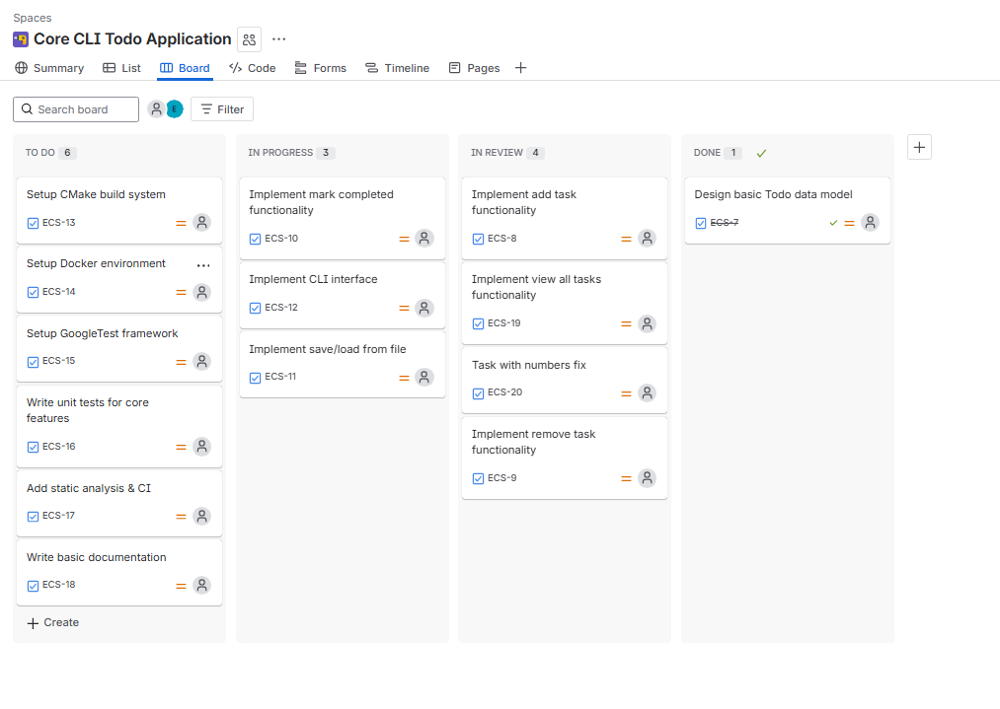

# Overengineered CLI C++ To-Do App

A small command-line To-Do application written in C++ — intentionally overengineered!

This project was created as a **learning exercise** to explore:

* Implementing **classes** (`Task` and `TodoApp`) in C++
* Using **CMake** for build management
* Organizing projects with **folders and headers**
* Using **Docker** for consistent development environments
* Following better **Git commit practices** with tools like **Jira**

---

## Features

* Add, view, and delete tasks
* Minimalistic CLI interface
* Task completion toggle (planned)
* Each task has an ID, description, and completion status
* Modular design using separate `.h` and `.cpp` files

---

## Project Structure

```ini
todo/
├─ include/
│   ├─ task.h
│   └─ todoapp.h
├─ src/
│   ├─ main.cpp
│   ├─ task.cpp
│   └─ todoapp.cpp
```

* `include/` — Header files for classes
* `src/` — Source files and `main.cpp`

---

## Jira 
This project is complex enough that I created a **Jira board** to manage tasks and track progress.  



---
## Build & Run

### Using g++

```bash
# From the project root
g++ src/*.cpp -I include -o todo.exe
./todo.exe
```

### Using CMake (optional)

```bash
# 1. Create a separate build directory
mkdir build
cd build

# 2. Configure the project
# Windows (MinGW):
cmake -G "MinGW Makefiles" ..
# Linux/macOS:
# cmake ..

# 3. Build the project
cmake --build .

# 4. Run the executable
# Windows
.\todo.exe
# Linux/macOS
# ./todo
```

### Using Docker (optional)

* Build a Docker image with C++ toolchain
* Compile and run the app inside a container for reproducibility

---

## Notes

* This is intentionally **overengineered** for a simple CLI app
* Designed for learning:

   * Class implementation and modular design in C++
   * Build tools like CMake
   * Docker-based development
   * Better Git commit practices using Jira tickets
